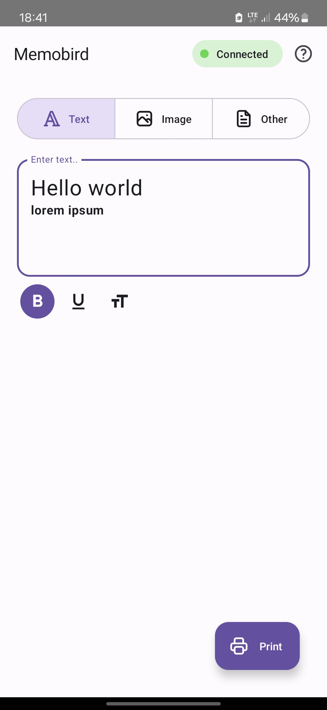
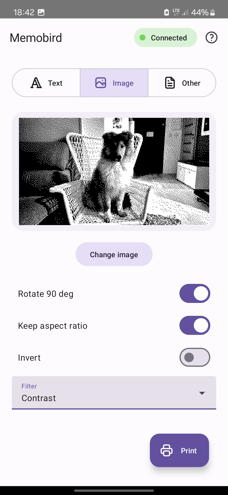
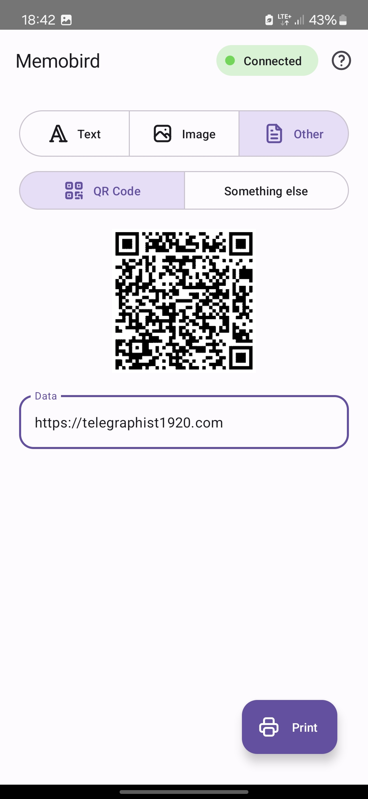
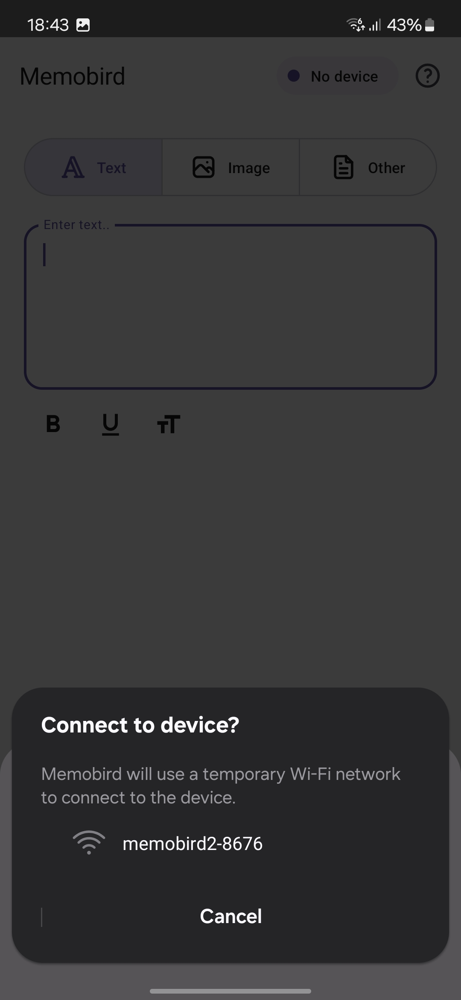
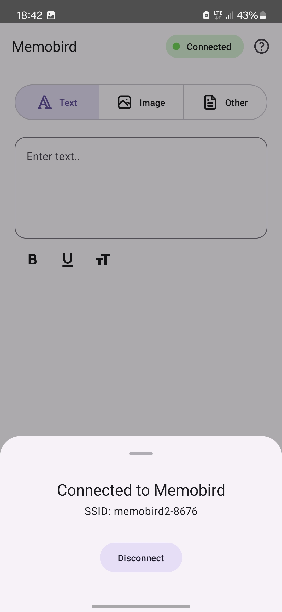

# Memobird App

Unofficial app for Memobird G2 inkless printer

I found a Memobird printer laying around, and it turned out the original app is not working anymore. So, I decided to create the app myself for fun. 
Simultaneously I learned Kotlin and [Compose Multiplatform](https://www.jetbrains.com/lp/compose-multiplatform/) from scratch.

## Download
[Download APK](https://github.com/jakub-lat/memobird-app/releases/latest)

## How it works
On Android, it uses a [temporary Wi-Fi connection](https://developer.android.com/develop/connectivity/wifi/wifi-bootstrap) to communicate with the printer - iOS isn't supported as for now.
Shout out to [LeMinaw/openmemobird](https://github.com/LeMinaw/openmemobird) for providing Memobird API "docs".

## Screenshots

  
  
  
  
  

## Known issues
* Sometimes the printer has a buffer overflow when requesting formatted text and prints random chinese characters and JSON
* Image height limit is 384px, only workaround that works is to split the image in parts, but then it produces large gaps.

## TODO
* Option to convert text to image for more flexibility and formatting
* Process images on-device instead of using the [server-side API](server/app.py)
* Add more printing options (e.g. drawings, barcodes, stickers)
* Make it work on iOS